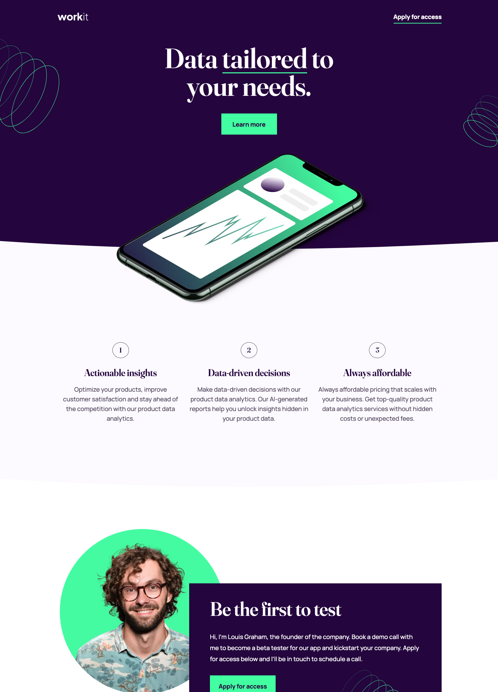

# Frontend Mentor - Workit landing page solution

This is a solution to the [Workit landing page challenge on Frontend Mentor](https://www.frontendmentor.io/challenges/workit-landing-page-2fYnyle5lu). Frontend Mentor challenges help you improve your coding skills by building realistic projects.

## Table of contents

- [Overview](#overview)
  - [The challenge](#the-challenge)
  - [Screenshot](#screenshot)
  - [Links](#links)
- [My process](#my-process)
  - [Built with](#built-with)
  - [What I learned](#what-i-learned)
  - [Useful resources](#useful-resources)
- [Author](#author)

## Overview

### 🫡 The challenge

Users should be able to:

- View the optimal layout for the interface depending on their device's screen size
- See hover and focus states for all interactive elements on the page

### Screenshots

##### 📱 Mobile View


##### 🖼️ Tablet View


##### 🖥️ Desktop View



### Links

- Live Site URL: [Workit Landing Page](https://workit-landing-page-smoky.vercel.app/)

## My process

### Built with

- Semantic HTML5 markup
- SASS
- Flexbox
- Mobile-first workflow

### What I learned

In this project I learned how to create curved background images. They look super cool and give a dynamic feel to your website, which can really bring it to life. I have used sites like [Haikei](https://haikei.app/) before to create waves/ blobs, but have usually used it also the whole background. Whereas in this challenge I have two seperate wavy backgrounds (the dark and light purple) which are positioned differently and somewhat stacked.

I found a [YouTube video](https://www.youtube.com/watch?v=NkgKIOTgvCI&list=PLHK07DoqLi18cCOWp-PpIhSvozWtTF5vs&index=3) which showed me a site for creating for helping me create wavy shapes to add to my CSS.

To see how I did this, check the code snippet below:

```css
.dark-purple-curve {
  position: absolute;
  top: 100%;
  left: 0;
  width: 100%;
  overflow: hidden;
  line-height: 0;
}

.dark-purple-curve svg {
  position: relative;
  display: block;
  width: calc(283% + 1.3px);
  height: 72px;
}

.dark-purple-curve .shape-fill {
  fill: $dark-purple;
}

.light-purple-curve {
  position: absolute;
  top: 100%;
  left: 0;
  width: 100%;
  overflow: hidden;
  line-height: 0;
}

.light-purple-curve svg {
  position: relative;
  display: block;
  width: calc(283% + 1.3px);
  height: 72px;
}

.light-purple-curve .shape-fill {
  fill: $ghost-white;
}
```

### Useful resources

- [shapedivider.app](https://www.shapedivider.app) - Free tool to make it easier for designers and developers to export a beautiful SVG
  shape divider for their latest project. We hope you enjoy this tool.

- [Practical Web Dev](https://www.youtube.com/watch?v=NkgKIOTgvCI&list=PLHK07DoqLi18cCOWp-PpIhSvozWtTF5vs&index=3) - This YouTube channel has some really helpful content, and this is the video which helped me figure out how to create wavy background images.


## Author

- Website - [Geoff Jamieson](https://www.geoffjamieson.com/)
- Frontend Mentor - [@UnionPAC](https://www.frontendmentor.io/profile/@UnionPAC)
- LinkedIn - [linkedin/geoffjamieson](https://www.linkedin.com/in/geoffjamieson/)
